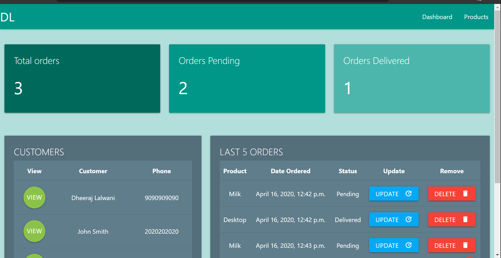
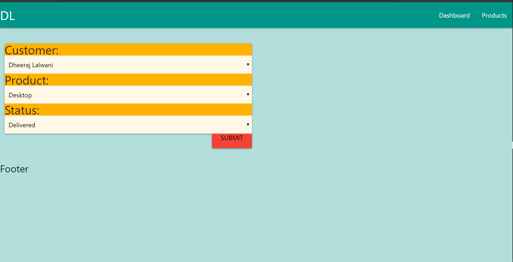
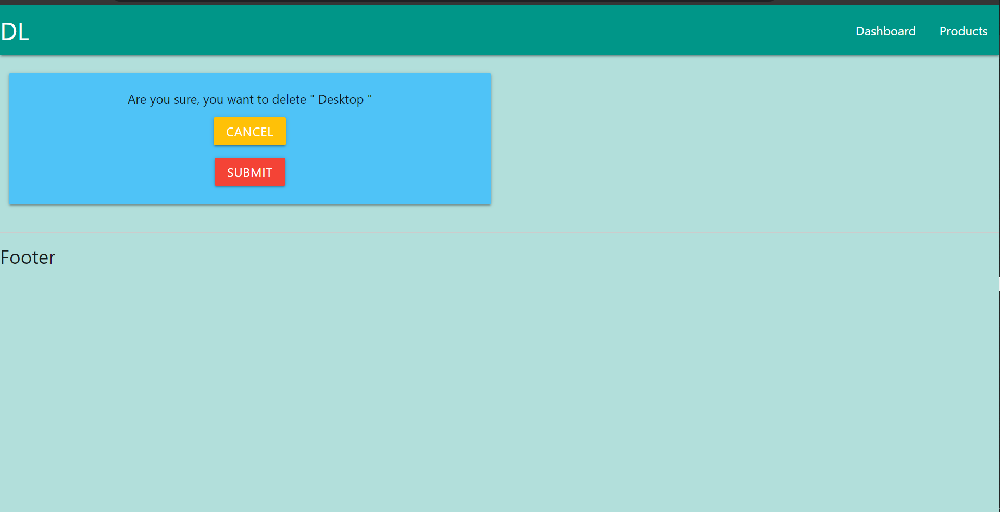

# customer-management-system
 This is a simple **Customer Management Interface** created with  **django framework**
 
 Actually, this  is a follow/code along project from a tutorial series that I have been watching from YouTube.
 
 The Name of the channel is ***Dennis Ivy***
 
 
 ## A few snaps from the snap shots:
 
 
 
 
 
 
 ## Link to the relevant resources
 
 - ###Main Tutorial Series
    - https://www.youtube.com/playlist?list=PL-51WBLyFTg2vW-_6XBoUpE7vpmoR3ztO
    
 - ###Official Django Docs
    - https://docs.djangoproject.com/en/3.0/
    
 - ###Brad Traversey's YouTube videos for Materialize CSS
    - https://youtu.be/nqT8c5OFjEQ (Part 1)
    - https://youtu.be/ZpduVPHZ5Aw (Part 2)
    
 - ###Official Materialize CSS Docs
    - https://materializecss.com/
    
 - ###Harsh Kapadia's Git Basics Repository (This really really helped me a lot!)
    - https://github.com/HarshKapadia2/git_basics
 
 ## Tech - Stack
 - Django  ==> _Backend_
 - Python ==> _Backend_
 - HTML ==> _Frontend_
 - CSS ==> _Frontend_
 - Materialize CSS ==> _Frontend_
 
 ## Stuff I learnt from other sources
 - Materialize framework (From Official docs and a Brads YouTube channel )
 - Git Basics
 - TO BE CONTINUED...
 - Links provided above.
 
 
 
 ## Stuff I learnt from the tutorial series
 - Getting Started with Django
 - Urls & Views
 - Templates & Inheritance
 - Static Files & Images
 - Database Models & Admin Panel
 - Database Relationships: One To Many and Many To One
 - Model Queries
 - Rendering Data to Templates & Template Tags
 - Dynamic URL Routing & Templates
 - Create | Read | Update | Delete  ==> CRUD
 - Model Forms
 - TO BE CONTINUED...
 

