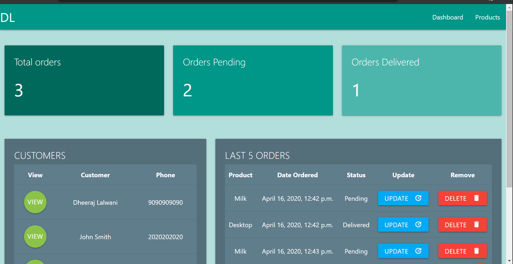
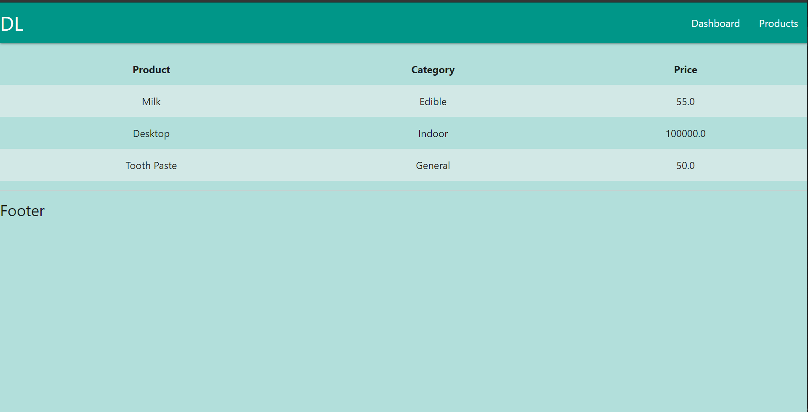
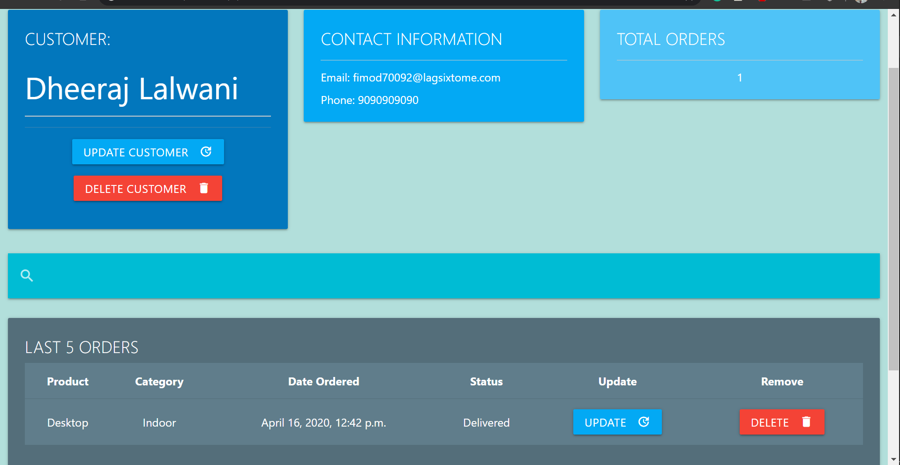
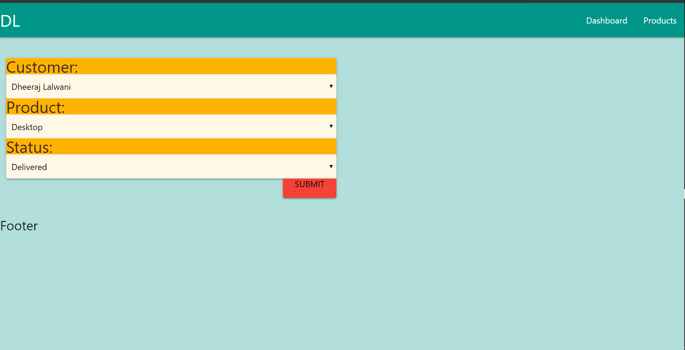
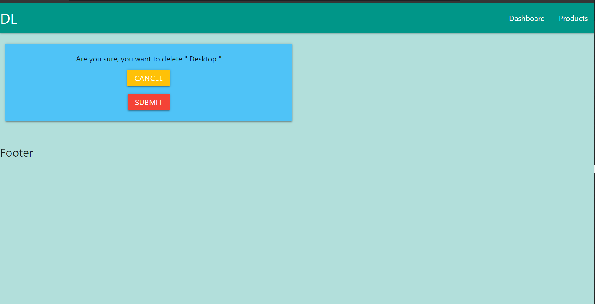

# customer-management
- A simple **Customer Management webapp** created from a **Django** Tutorial.
- Main code in the `CMS` folder.

## Resources
- [Django project by Dennis Ivy](https://www.youtube.com/playlist?list=PL-51WBLyFTg2vW-_6XBoUpE7vpmoR3ztO) 
- Materialize CSS by Brad Traversy
   - Part 1: https://youtu.be/nqT8c5OFjEQ
   - Part 2: https://youtu.be/ZpduVPHZ5Aw  
- [Harsh Kapadia's Git Basics Repository](https://github.com/HarshKapadia2/git_basics) (This really really helped me a lot!)

## Tech stack
- Front end
   - HTML
   - Materialize CSS
- Back end
   - Django

## A few snap shots of the project

